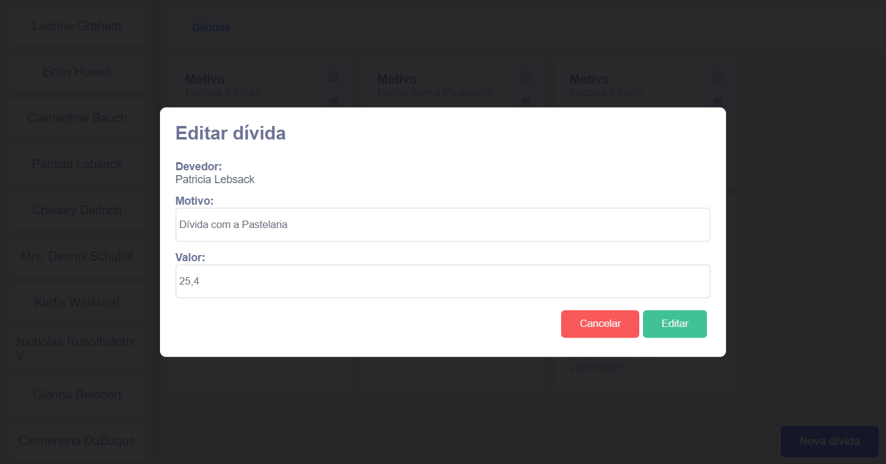

<h1 align="center">
  Debtor Management
</h1>

<p align="center">

<h4 align="center">
  Projeto para atribuir dívidas a usuarios de uma API.
</h4>

<p align="center">
  <a href="#rocket-tecnologias">Tecnologias usadas</a>&nbsp;&nbsp;&nbsp;|&nbsp;&nbsp;&nbsp;
  <a href="#memo-como-usar">Como usar</a>
</p>


<br/>


## :rocket: Tecnologias
O projeto foi desenvolvido com as seguintes tecnologias:

- [ReactJS](https://reactjs.org/)
- [Typescript][ts]
- [Styled Components](https://www.styled-components.com/)
- [Axios](https://github.com/axios/axios)
- [Formik](https://formik.org/)


- [VS Code][vscode] com [EditorConfig][vceditconfig] e [ESLint][vceslint]
---
## :memo: Como usar ?
1. Primeiramente clone o projeto.

```bash
git clone https://github.com/adrielborges/react-typescript-debtor-management
```
2. Entre na pasta do projeto.

```bash
  cd react-typescript-debtor-management
```
3. Instale as dependências.

* **npm**
```bash
npm install
```
* **yarn**
```bash
yarn
```
4. Renomeie o arquivo `.env.example` para `.env.local` e dentro dele substitua o `uuid-key-to-api` pela sua chave de acesso a api.
<br/>

5. Para iniciar a aplicação:
* **npm**
```bash
npm run start
```
* **yarn**
```bash
yarn start
```

---

Feito por Adriel Borges :wave: [Vamo se conectar!](https://www.linkedin.com/in/adriel-borgesti/)

[ts]: https://www.typescriptlang.org
[vscode]: https://code.visualstudio.com/
[yarn]: https://yarnpkg.com/
[vceditconfig]: https://marketplace.visualstudio.com/items?itemName=EditorConfig.EditorConfig
[vceslint]: https://marketplace.visualstudio.com/items?itemName=dbaeumer.vscode-eslint
